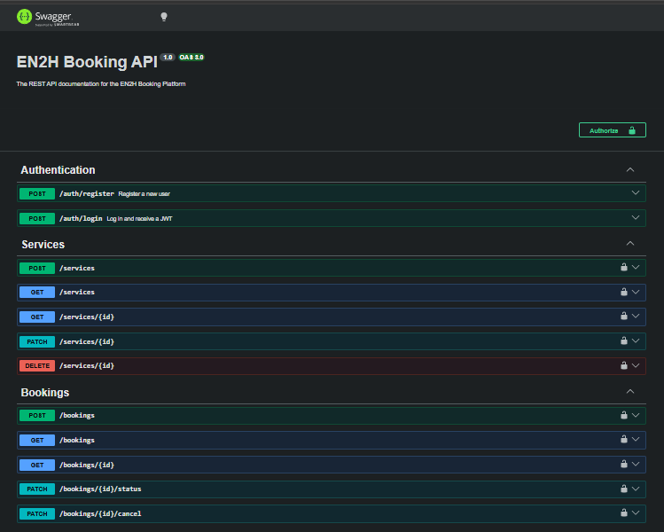

# EN2H Booking Platform API

A robust RESTful API built with **NestJS** for managing services and customer bookings.  
This project was developed as the technical assessment for the **EN2H Backend Engineering Internship**.

---

## 📌 Project Overview

The EN2H Booking Platform API allows:

- Administrators/authenticated users to manage services
- Customers to create bookings without authentication
- Authenticated users to view and manage bookings

The application follows a **modular monolithic architecture** using NestJS best practices, with clear separation between controllers, services, entities, DTOs, and authentication modules.

---

## 🚀 Key Technologies Used

| Technology | Purpose |
|---|---|
| NestJS | Backend framework |
| TypeScript | Programming language |
| PostgreSQL | Database |
| TypeORM | Database ORM |
| JWT + Passport | Authentication |
| Swagger | API Documentation |
| Class Validator | DTO validation |
| Class Transformer | Data transformation |

---

# ✨ Implemented Features

## Core Features

### Service Management
- Create services
- View available services
- Update services
- Delete services

### Booking Management
- Create customer bookings
- View bookings
- View individual bookings
- Update booking status
- Cancel bookings

### Authentication
- User registration
- User login
- JWT-based authentication
- Protected API endpoints

---

# ⭐ Bonus Features Implemented

## 1. Global Exception Handling

Implemented a custom exception filter to provide consistent API error responses.

Example response:

```json
{
  "statusCode": 400,
  "message": "Validation failed",
  "timestamp": "2026-07-12T10:30:00.000Z"
}
```

---

## 2. Swagger API Documentation

Interactive API documentation is available using Swagger UI.

Swagger provides:

- API endpoint documentation
- Request/response examples
- JWT authentication testing
- DTO validation visibility

### Swagger UI Screenshot



Swagger URL:

```
http://localhost:3000/api/docs
```

---

## 3. Duplicate Booking Prevention

Implemented business logic to prevent duplicate bookings.

The system prevents booking the same:

- Service
- Date
- Time slot

when an existing confirmed booking already exists.

---

## 4. Booking Status Filtering

Added query filtering support for:

```
GET /bookings?status=CONFIRMED
```

Supported statuses:

- CONFIRMED
- CANCELLED
- COMPLETED

---

# ⚙️ Installation Guide

## 1. Clone Repository

```bash
git clone <repository-url>

cd en2h-booking-api
```

---

## 2. Install Dependencies

```bash
npm install
```

---

# 🔐 Environment Configuration

Create a `.env` file in the project root.

Example:

```env
DB_HOST=localhost
DB_PORT=5432
DB_USERNAME=postgres
DB_PASSWORD=your_password
DB_DATABASE=en2h_booking

PORT=3000

JWT_SECRET=your_secret_key
JWT_EXPIRATION=1d
```

---

# 🗄️ Database Setup

Make sure PostgreSQL is installed and running.

Create a database:

```
en2h_booking
```

Example using PostgreSQL:

```sql
CREATE DATABASE en2h_booking;
```

---

# 🔄 Running Database Migrations

Generate migration:

```bash
npm run migration:generate
```

Run migrations:

```bash
npm run migration:run
```

This will create all required database tables.

---

# ▶️ Running the Application

## Development Mode

```bash
npm run start:dev
```

## Production Mode

```bash
npm run start:prod
```

Application will run on:

```
http://localhost:3000
```

---

# 📚 API Documentation

Swagger documentation:

```
http://localhost:3000/api/docs
```

From Swagger UI you can:

1. Register a user
2. Login and receive JWT token
3. Click **Authorize**
4. Enter:

```
Bearer <your_token>
```

5. Test protected endpoints

---

# 📂 Project Structure

```
src
│
├── auth
│   ├── controllers
│   ├── services
│   └── strategies
│
├── modules
│   ├── services
│   └── bookings
│
├── common
│   ├── guards
│   └── filters
│
├── config
│
└── migrations
```

---

# 🧪 Testing

Run unit tests:

```bash
npm run test
```

Run test coverage:

```bash
npm run test:cov
```

---

# 📝 Assumptions Made

## Role Management

The requirement mentioned:

> Only authenticated users can manage services.

A simplified authorization approach was implemented where registered users authenticated through JWT can access protected management endpoints.

---

## Booking Creation

Customers can create bookings without authentication as required.

---

## Booking Time Format

Booking times are stored using:

```
HH:MM
```

format.

Example:

```
14:30
```

---

## Authentication Choice

A native JWT authentication system using Passport was implemented instead of an external authentication provider to demonstrate backend security fundamentals.

---

# 👨‍💻 Author

Developed as part of the EN2H Backend Engineering Internship Technical Assessment.